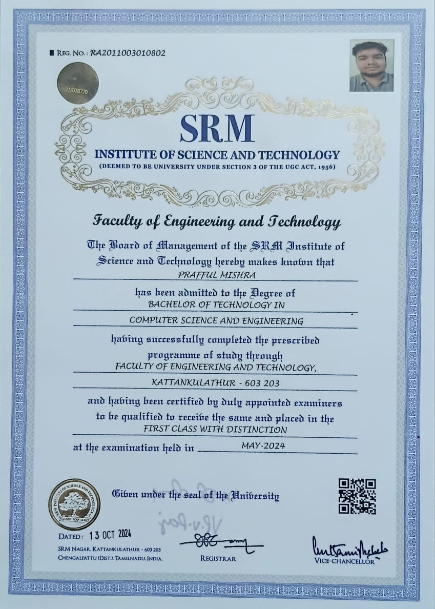

<div align="center">

<!-- ANIMATED HEADER -->


<!-- TYPING ANIMATION -->

<a href="https://git.io/typing-svg"></a>

<!-- DYNAMIC BADGES -->
<p align="center">
  
  
  
  <a href="./Prafful_Mishra_Resume.pdf"></a>
</p>

---

</div>

<br>

<!-- ABOUT ME SECTION -->

## 💻 `$ whoami`

```bash
prafful@github:~$ cat about.txt

> Systems Engineer @ Tata Consultancy Services
> Building ML pipelines that process 4,400+ legal docs with 66% faster throughput
> Modernizing legacy mainframe → microservices | TypeScript + AWS Lambda + DB2
> GATE Qualified (CS&IT) | CGPA: 9.61/10 | SRM Academic Winner '24

🔭 Currently: Architecting serverless ML infrastructure on AWS
🌱 Learning: Advanced Kubernetes orchestration & LLM fine-tuning
⚡ Fun Fact: Patented 2 AI systems before graduation | Chess enthusiast ♟️
```

<br>

---

<br>

<!-- TECH STACK SECTION -->

## 🛠️ **Tech Arsenal**

<div align="center">

### **Languages**

<p>
  
</p>

### **AI/ML & Data Science**

<p>
  
  
  
</p>

### **Cloud & DevOps**

<p>
  
</p>

#### **AWS Services**

<p>
  
  
  
  
  
</p>

### **Frameworks & Tools**

<p>
  
  
</p>

### **Databases**

<p>
  
</p>

</div>

<br>

---

<br>

<!-- EDUCATION SHOWCASE -->
<div align="center">

## 🎓 **Education Showcase**

<details>
<summary><b>🏛️ Click to view my degree certificate</b></summary>

<br>

<div style="border: 3px solid; border-image: linear-gradient(45deg, #FFD700, #FFA500, #FFD700) 1; padding: 20px; animation: borderAnimation 3s infinite;">



**Bachelor of Technology in Computer Science and Engineering**  
🏫 SRM Institute of Science and Technology, Chennai  
📅 September 2020 – May 2024  
🎯 CGPA: **9.61/10** | **First Class with Distinction**

</div>

</details>

</div>

<style>
@keyframes borderAnimation {
  0%, 100% { border-image-source: linear-gradient(45deg, #FFD700, #FFA500); }
  50% { border-image-source: linear-gradient(45deg, #FFA500, #FFD700); }
}
</style>

<br>

---

<br>

<!-- PROJECTS SECTION -->

## 🚀 **Featured Projects**

<div align="center">

|                                                                     🎯 Project                                                                      |                                                                                                                                                                                           🛠️ Tech Stack                                                                                                                                                                                           |                                                                                    🎬 Demo                                                                                    |
| :-------------------------------------------------------------------------------------------------------------------------------------------------: | :-----------------------------------------------------------------------------------------------------------------------------------------------------------------------------------------------------------------------------------------------------------------------------------------------------------------------------------------------------------------------------------------------: | :---------------------------------------------------------------------------------------------------------------------------------------------------------------------------: |
| **Optimal Crop Recommendation System** <br> _Compound-Ensemble ML model with 99% accuracy_ <br> Integrated 12 weak classifiers + Genetic Algorithms |      | [](https://www.youtube.com/embed/sCcLKE5mnjc?si=74hF9Krv2KPZMI6n) |
|  **AI-Driven Vehicle Safety System** <br> _ANN-based prototype simulating 18% crash risk reduction_ <br> Patent-pending speed limiting innovation   |     |                      [](https://youtube.com)                      |

</div>

<br>

---

<br>

<!-- EXPERIENCE SECTION -->

## 💼 **Professional Journey**

<details open>
<summary><b>🏢 Tata Consultancy Services (TCS) — Systems Engineer</b> | Dec 2024 – Present</summary>

<br>

**📍 Location:** Chennai, Tamil Nadu

**🔧 Key Contributions:**

- 🚀 Built a **ML pipeline** processing **4,400+ legal documents** with **66% faster throughput** using **AWS Lambda** and **TypeScript**
- ⚙️ Modernizing **legacy mainframe workloads** into **Java/TypeScript microservices** backed by **DB2**
- 📝 Developed **TypeScript-based dynamic form processing** across **JSON, XML, and ODT** with **Lambda-driven payloads**
- ☁️ Architecting **serverless infrastructure** for scalable document processing

**🏆 Recognition:**

<details>
<summary>🥇 Best Team Award (June 2025)</summary>

<br>


> _"In appreciation of outstanding contribution to the organisation"_

</details>

</details>

<details>
<summary><b>🔬 Samsung PRISM — ML Intern</b> | April 2023 – September 2023</summary>

<br>

**📍 Location:** Chennai, Tamil Nadu

**🎯 Achievements:**

- 🖼️ Engineered a **high-resolution dataset of 2,500 images** for object detection
- 🧠 Fine-tuned **ResNet-based CNN** achieving **97% accuracy**
- 📉 Implemented **Float-16 quantization**, compressing model size by **80%**
- 🔍 Optimized inference speed for edge deployment

</details>

<details>
<summary><b>📊 SRM Research Initiative (SERI) — Research Intern</b> | Oct 2022 – Dec 2023</summary>

<br>

**📍 Location:** Chennai, Tamil Nadu

**🔬 Research Focus:**

- 🌾 Collected and analyzed **24 unique soil samples** for agricultural applications
- 🌧️ Developed an **Intensified LSTM model** for rainfall forecasting with **RMSE of 0.8**
- 📄 **Co-authored** a research publication contributing **3 unique insights** (published in Springer)
- 🤖 Integrated IoT sensors for real-time environmental monitoring

</details>

<br>

---

<br>

<!-- RESEARCH & IP SECTION -->
<div align="center">

## 🏆 **Research & Intellectual Property**

<div style="border: 4px solid; border-image: linear-gradient(90deg, #FFD700, #FFA500, #FFD700, #FFA500) 1; padding: 30px; border-radius: 15px; background: linear-gradient(135deg, rgba(255,215,0,0.05), rgba(255,165,0,0.05)); animation: goldenGlow 4s infinite;">

### 📜 **Patents Granted**

<table align="center">
<tr>
<td width="50%" valign="top">

<details>
<summary><b>🇮🇳 Indian Patent No. 564654</b></summary>

<br>


**📋 Title:** AI-Driven Centralized Vehicle Control and Monitoring System

**🔬 Innovation:** ANN-based automotive safety prototype integrating ML + IoT sensors for real-time risk assessment and speed control

**📅 Filed:** October 3, 2023  
**✅ Granted:** March 30, 2025  
**⚖️ IPC Classification:** G06F 21/55

**💡 Impact:** Simulates **18% reduction in crash risk** through predictive AI intervention

</details>

</td>
<td width="50%" valign="top">

<details>
<summary><b>🇩🇪 German Patent No. 20 2025 101 529</b></summary>

<br>

**📋 Title:** A System for Securing Patient Data in IoT-Enabled Hospitals

**🔬 Innovation:** Blockchain-integrated security framework with advanced PII masking and cryptographic protection for healthcare IoT networks

**📅 Filed:** March 20, 2025  
**✅ Registered:** April 1, 2025  
**⚖️ IPC Classification:** G06F 21/55

**💡 Key Features:**

- 🔐 Public/private key cryptography
- 🛡️ Pre-processing with PII data masking
- ⛓️ Blockchain-based secure data blocks
- 🏥 Resilient against cyber threats in healthcare

</details>

</td>
</tr>
</table>

---

### 📚 **Research Publications**

<table align="center">
<tr>
<td width="50%" align="center">

**📘 Published in Springer** _(Feb 2024)_


**3rd International Conference on Recent Trends in Engineering, Technology and Business Management**

_Mitigating Ransomware in IoT-enabled Hospitals using Blockchain and AI/ML Techniques_

<details>
<summary>📜 View Conference Certificate</summary>

<br>


</details>

</td>
<td width="50%" align="center">

**📗 ScienceDirect** _(Under Review)_


**Optimizing Crop Selection for Sustainable Agriculture**

_A Compound Ensemble Approach Integrating Machine Learning and IoT-based Sensors_

**Key Contribution:** 99% accuracy through 12-classifier ensemble + Genetic Algorithm tuning

</td>
</tr>
</table>

</div>

</div>

<style>
@keyframes goldenGlow {
  0%, 100% {
    box-shadow: 0 0 20px rgba(255,215,0,0.3), 0 0 40px rgba(255,165,0,0.2);
  }
  50% {
    box-shadow: 0 0 30px rgba(255,215,0,0.5), 0 0 60px rgba(255,165,0,0.3);
  }
}
</style>

<br>

---

<br>

<!-- GITHUB STATS SECTION -->

## 📊 **GitHub Analytics**

<div align="center">

<!-- Snake Animation -->
<picture>
  <source media="(prefers-color-scheme: dark)" srcset="https://raw.githubusercontent.com/im-prafful/im-prafful/output/github-contribution-grid-snake-dark.svg">
  <source media="(prefers-color-scheme: light)" srcset="https://raw.githubusercontent.com/im-prafful/im-prafful/output/github-contribution-grid-snake.svg">
  
</picture>

<br><br>

<!-- Stats Cards -->
<p align="center">
  
  
</p>

<!-- Streak Stats -->
<p align="center">
  
</p>

<!-- Trophies -->
<p align="center">
  
</p>

</div>

<br>

---

<br>

<!-- ACHIEVEMENTS SECTION -->

## 🏅 **Achievements & Recognition**

<div align="center">

|        🏆 Achievement         | 📅 Year |           🔗 Proof           |
| :---------------------------: | :-----: | :--------------------------: |
| **GATE Qualified** (CS & IT)  |  2024   |              ✅              |
| **SRM Academic Winner Award** |  2024   |              ✅              |
| **Project Expo - 2nd Place**  |  2024   |              🥈              |
|      **CodeChef 3-Star**      | Ongoing |            ⭐⭐⭐            |
|    **TCS Best Team Award**    |  2025   | [🏆](#-professional-journey) |

</div>

<br>

---

<br>

<!-- HOBBIES SECTION -->

## 🎯 **Beyond Code**

<div align="center">

<table>
<tr>
<td align="center" width="50%">

♟️ **Chess Enthusiast**  
Strategic thinking translates to algorithmic problem-solving

</td>
<td align="center" width="50%">

✈️ **Travel Explorer**  
Exploring cultures, collecting experiences

</td>
</tr>
</table>

</div>

<br>

---

<br>

<!-- CONNECT SECTION -->

## 🌐 **Let's Connect**

<div align="center">

<p>
  <a href="https://linkedin.com/in/prafful-mishra-9607b7209"></a>
  <a href="mailto:imprafful26@gmail.com"></a>
  <a href="https://github.com/im-prafful"></a>
  <a href="tel:+918969729975"></a>
</p>

**📍 Location:** Chennai, Tamil Nadu, India  
**🌍 Open to:** Remote Work | Collaborations | Research Opportunities

</div>

<br>

---

<div align="center">

### 💬 _"Transforming ideas into intelligent systems, one commit at a time."_


</div>

<!-- VISITOR COUNTER -->
<div align="center">
  
</div>
