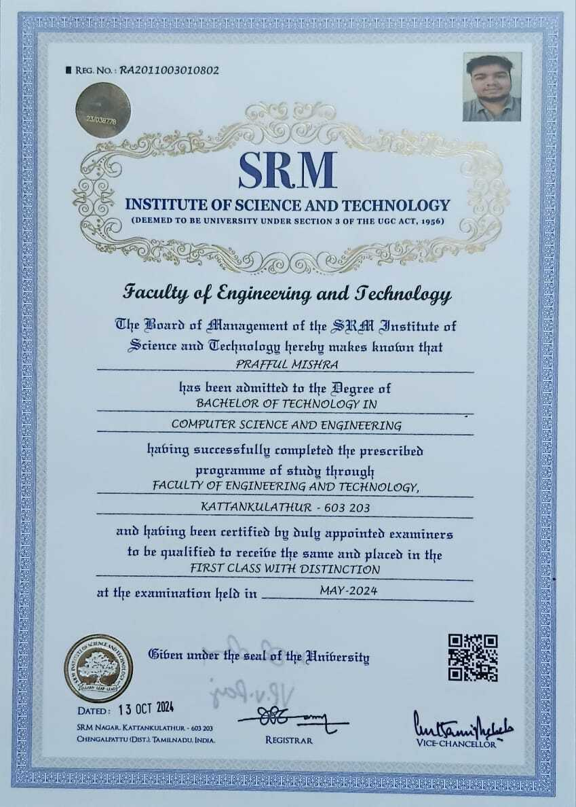
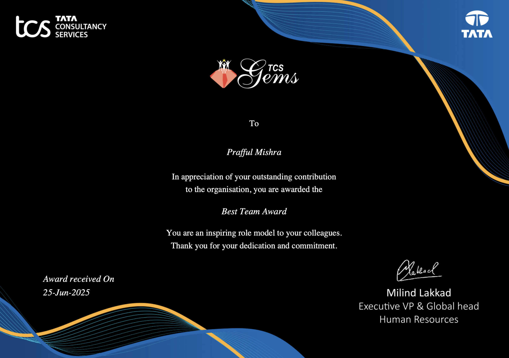
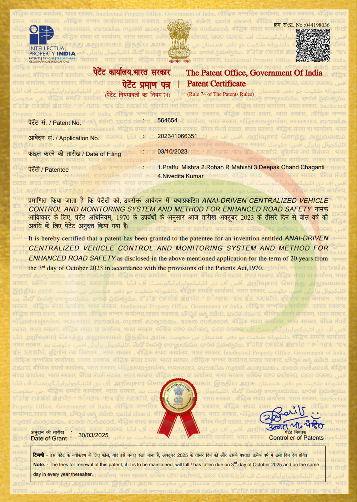
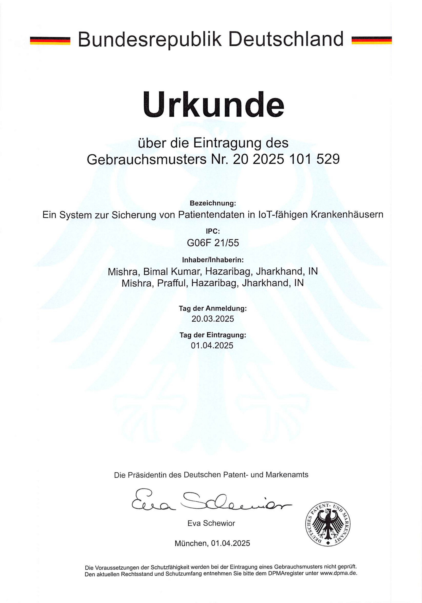
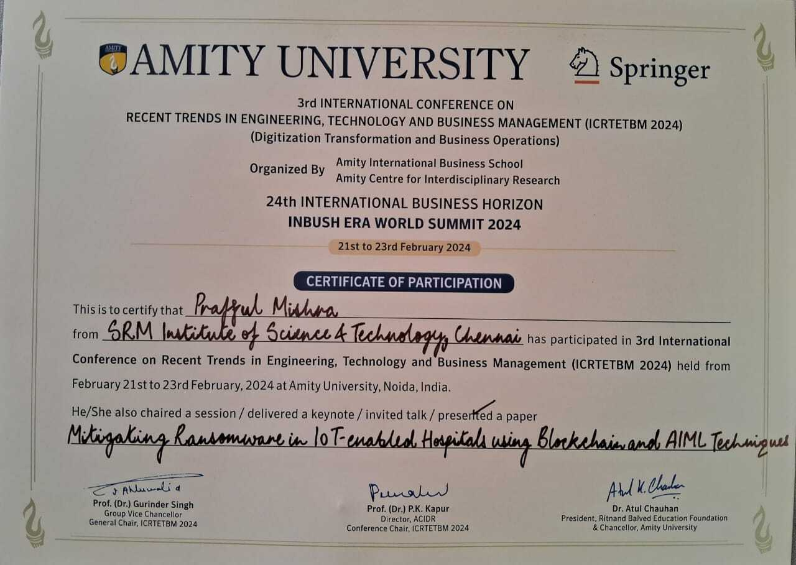

<div align="center">

<!-- ANIMATED HEADER -->


<!-- TYPING ANIMATION -->
<a href="https://github.com/im-prafful">
  
</a>

<br>

<!-- BADGES -->
<p>
  <a href="https://linkedin.com/in/prafful-mishra-9607b7209/"></a>
  <a href="mailto:imprafful26@gmail.com"></a>
  <a href="https://www.codechef.com/users/im_prafful"></a>
  <a href="./Prafful_Mishra_Resume.pdf"></a>
</p>


</div>

---

## 👨‍💻 About Me

```console
prafful@github:~$ whoami

> Systems Engineer @ Tata Consultancy Services (Dec 2024 - Present)
> Gold Medalist (CGPA 9.61/10) | SRM Institute of Science and Technology
> GATE Qualified (CS & IT) | 2 Patents Filed | Research Published in Springer (soon)

🔭 Building ML pipelines processing 4,400+ legal docs with 66% faster throughput
🌱 Modernizing legacy mainframes → Java/TypeScript microservices
⚡ Specializing in AWS Lambda | Docker | AI/ML | Serverless Architecture
🎯 2 Patents | 2 Research Papers (in-review) | 3-Star CodeChef
```

<div align="center">

**I live at the intersection of applied engineering and academic research** — building systems that _actually_ matter.

</div>

---

## 🛠️ Tech Stack

<div align="center">

### Languages


### AI/ML & Data Science


### Cloud & DevOps


**AWS Tools:** Lambda · EC2 · S3 · SQS · RDS · CloudWatch

### Frameworks & Databases


</div>

---

## 🎓 Education

<details open>
<summary><b>🏛️ Bachelor of Technology in Computer Science & Engineering</b></summary>

<br>

<div align="center">



**SRM Institute of Science and Technology, Chennai**  
📅 September 2020 – May 2024  
🎯 CGPA: **9.61/10** | **First Class with Distinction**  
🏆 SRM Academic Winner Award 2024

</div>

</details>

---

## 💼 Professional Experience

<details open>
<summary><b>🚀 Systems Engineer @ Tata Consultancy Services (TCS)</b> · Dec 2024 - Present</summary>

<br>

**📍 Chennai, Tamil Nadu**

- 🚀 Built ML pipeline processing **4,400+ legal documents** with **66% faster throughput** using AWS Lambda & TypeScript
- ⚙️ Modernizing **legacy mainframe workloads** into Java/TypeScript microservices backed by DB2
- 📝 Developed TypeScript-based **dynamic form processing** across JSON, XML, and ODT formats
- ☁️ Architecting serverless infrastructure for scalable document processing workflows

**🏆 Recognition:**

<details>
<summary>🥇 Best Team Award (June 2025)</summary>

<br>

<div align="center">

</div>

</details>

</details>

<details>
<summary><b>🤖 ML Intern @ Samsung PRISM</b> · April 2023 - September 2023</summary>

<br>

**📍 Chennai, Tamil Nadu**

- 🖼️ Engineered **high-resolution dataset of 2,500 images** for object detection tasks
- 🧠 Fine-tuned **ResNet-based CNN** achieving **97% accuracy**
- 📉 Implemented **Float-16 quantization**, compressing model size by **80%**
- 🔍 Optimized inference speed for edge deployment scenarios

</details>

<details>
<summary><b>🔬 Research Intern @ SERI, SRM</b> · October 2022 - December 2023</summary>

<br>

**📍 Chennai, Tamil Nadu**

- 🌾 Collected and analyzed **24 unique soil samples** for agricultural applications
- 🌧️ Developed **Intensified LSTM model** for rainfall forecasting with **RMSE of 0.8**
- 📄 **Co-authored research publication** contributing 3 unique insights (Published in Springer)
- 🤖 Integrated IoT sensors for real-time environmental monitoring

</details>

---

## 🚀 Featured Projects

<div align="center">

<table>
<tr>
<td width="50%" valign="top">

### 🌾 Optimal Crop Recommendation

<div align="center">
<a href="https://www.youtube.com/embed/sCcLKE5mnjc?si=TT6lSjf_Y7KRs9Jz">

<br><br>

</a>
</div>

<br>

**Tech Stack:**  


**Highlights:**

- 🎯 **99% accuracy** using Compound-Ensemble of 12 classifiers
- 🧬 Genetic Algorithms for hyperparameter tuning (+4-5% improvement)
- ✅ **83% match rate** validated with TN Government data

</td>
<td width="50%" valign="top">

### 🚗 AI Vehicle Safety System

<div align="center">
<a href="https://www.youtube.com/embed/8Tix9FgEa9k?si=yJGkN8GK7Xm0mCn8">

<br><br>

</a>
</div>

<br>

**Tech Stack:**  


**Highlights:**

- 🧠 Lightweight ANN achieving **92% accuracy**
- 🛡️ Simulated **18% reduction in crash risk**
- 📜 **Patent filed** for proprietary speed-limiting system

</td>
</tr>
</table>

</div>

---

## 🏆 Research & Intellectual Property

<div align="center">
<br>

> ### 📜 Patents Granted

<table>
<tr>
<td align="center" width="50%">

**🇮🇳 Indian Patent**



**Patent No. 564654**  
_AI-Driven Centralized Vehicle Control and Monitoring System_

📅 Filed: Oct 2023 | Granted: Mar 2025  
🔬 ANN + IoT sensors for real-time risk assessment

</td>
<td align="center" width="50%">

**🇩🇪 German Patent**



**Patent No. 20 2025 101 529**  
_System for Securing Patient Data in IoT-Enabled Hospitals_

📅 Filed: Mar 2025 | Registered: Apr 2025  
🔐 Blockchain + PII masking for healthcare security

</td>
</tr>
</table>

<br>

> ### 📚 Research Publications

<table>
<tr>
<td width="70%">

**Published in Springer** _(February 2024)_  
📘 _Mitigating Ransomware in IoT-enabled Hospitals using Blockchain and AI/ML Techniques_

Presented at: **3rd International Conference on Recent Trends in Engineering, Technology and Business Management (ICRTETBM 2024)**

</td>
<td width="30%" align="center">

<details>
<summary>📜 <b>View Certificate</b></summary>
<br>

</details>

</td>
</tr>
<tr>
<td width="70%">

**Under Review - ScienceDirect**  
📗 _Optimizing Crop Selection for Sustainable Agriculture: A Compound Ensemble Approach Integrating Machine Learning and IoT-based Sensors_

Key Innovation: 99% accuracy through 12-classifier ensemble + Genetic Algorithm optimization

</td>
<td width="30%" align="center">


</td>
</tr>
</table>

</div>

---

## 🏅 Achievements

<div align="center">

| 🏆 Achievement                             |  Year   | Status |
| :----------------------------------------- | :-----: | :----: |
| **GATE Qualified** (Computer Science & IT) |  2024   |   ✅   |
| **SRM Academic Winner Award**              |  2024   |   ✅   |
| **Project Expo - 2nd Place**               |  2024   |   🥈   |
| **CodeChef 3-Star Coder**                  | Ongoing | ⭐⭐⭐ |
| **TCS Best Team Award**                    |  2025   |   🏆   |

</div>

---

## 📊 GitHub Statistics

<div align="center">

<!-- Snake Animation -->
<picture>
  <source media="(prefers-color-scheme: dark)" srcset="https://raw.githubusercontent.com/im-prafful/im-prafful/output/github-contribution-grid-snake-dark.svg">
  <source media="(prefers-color-scheme: light)" srcset="https://raw.githubusercontent.com/im-prafful/im-prafful/output/github-contribution-grid-snake.svg">
  
</picture>

<br><br>

<!-- Stats Cards -->
<p align="center">
  
</p>

<br>

<!-- Streak Stats -->


</div>

---

## 🎯 Beyond Code

<div align="center">

|                      ♟️ Chess                       |                 ✈️ Travel                  |         💻 Problem Solving         |
| :-------------------------------------------------: | :----------------------------------------: | :--------------------------------: |
| Strategic thinking translates to algorithmic design | Exploring cultures, collecting experiences | Continuous learning & optimization |

</div>

---

## 📬 Let's Connect

<div align="center">

<p>
  <a href="https://linkedin.com/in/prafful-mishra-9607b7209/"></a>
  <a href="mailto:imprafful26@gmail.com"></a>
  <a href="https://github.com/im-prafful"></a>
  <a href="tel:+918969729975"></a>
</p>

**📍 Location:** Hazaribagh, Jharkhand, India  
**🌐 Open to:** Remote Work | Collaborations | Research Opportunities

<br>

_"The best way to predict the future is to invent it."_

<br>


</div>
